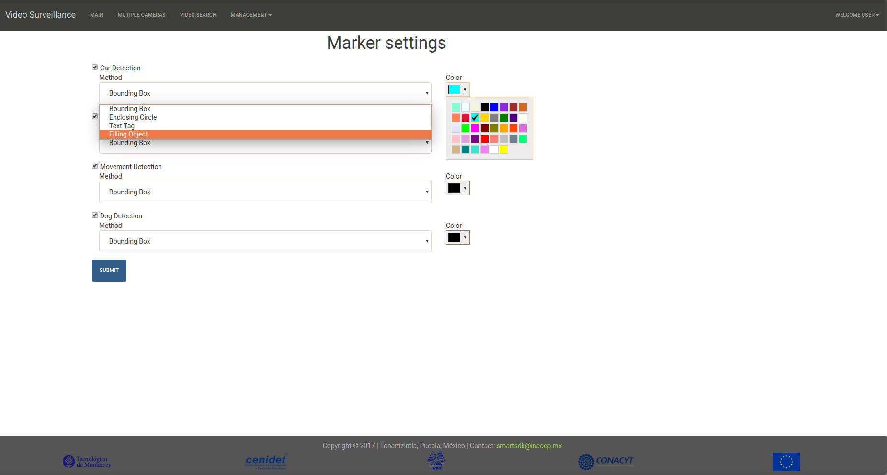

# Manual de la aplicación Smart Security
 
## Requerimientos

Para un funcionanmiento adecuado debe utilizarse `Google Chrome` como navegador .

## Interfaz de Usuario

La interfaz gráfica de usuario fue desarrollada utilizando el fremwork `Web2Py`, el cual permite el desarrollo rápido de aplicacciones web con el lenguaje Python como base. Este framework utiliza el patrón arquitectónico Modelo Vista-Controlador (MVC) para el desarrollo de éste tipo de aplicaciones.

El prototipo actual del sistema de Smart Security ofrece cinco diferentes vistas al usuario: `Login`, `Main`, `Multiple Cameras`, `Search` and `Management`. 

## Registro de un usuario

La vista `Login` evita que usuarios no autorizados accesen al sistema bloqueando el resto de las vistas y los privilegios de gestión. Es por esto que antes de utilizar el sistema se requiere realizar un proceso de registro.

Para registrar un usuario nuevo:

1. Click en el menú `Login In` y seleccionar la opción `Sign up`(esquina superior derecha de la vista `Login`).

2. En la vista `Login` debemos indicar el nombre de usuario y el password del usuario nuevo.

La información se envía al adminstrador del sistema para autorizar el acceso del usuario nuevo.

## Inicio de sesión

Una vez que se cuenta con usuario registrado, es posible accesar al sistema utilizando la vista `Login`.

Para accesar al sistema:

1. Click en la opción`Login` y seleccionar la opción `Log in`(esquina superior detecha de la vista `Login`).

2. En la vista `Login` indicar el nombre y contraseña de usuario.

## Grabación por movimiento

De manera predeterminada el sistema es capaz de grabar video por movimiento detectado en la escena.

## Visualización de una cámara

Para visualizar una cámara en específico:

1. Click en la opción `Main`.

2. Cuando la vista `Main` este cargada, en la barra de desplazamiento inferior seleccionar la cámara deseada.

## Visualización de los últimos eventos detectados (In progress).

Toda actividad detectada por el sistema es reportada y visualizada al usuario. Para ver un listado de las actividades detectadas:

1. Click en la opción `Main`.

2. Ir al cuadro de texto `Last Activity` (lado derecho de la vista `Main`).

## Vizualización de varias cameras

Para un panorama general del área vigilada, el sistema es capaz de mostrar todas las cámaras registradas en la vista `Multiple Cameras`.
 
1. Click en la opción `Multiple Cameras`.

2. Todas las cámaras registradas estan visibles.

 
## Búsqueda

El sistema permite al usuario buscar videos asociados con los eventos detectados. Dos criterios definen el tipo de búsqueda a relizar: por anotación o por imagen.

### Busqueda por anotación (Filtros)

Esta opción de búsqueda contiene opciones para buscar por tipo de evento (Persona o vehicle detectado), por fecha de detección y/o por el id de la cámara de interes.

Para buscar videos por anotacion:

1. Click en the opción `Search`.

2. Seleccionar the  botón de radio `Filters`.

3. En la vista `Search`, definir los subcriterios de búsqueda.

- `Event Type`: Seleccionar el typo de evento que quieres buscar. Si ninguna opción se selecciona, se mostrarán todos los tipos de eventos.

- `Camera id`: Seleccionar el id de la cámara deseada.

- `Date`: El usuario puede definir un rango de fechas a través de de dos calendarios.

4. Click en el botón `Filter Events`.

5. El resultado de la búsqueda es visualizado en el cuadro de texto inferior.

### Búsqueda por imagen(Rostro)

Esta opción de búsqueda permite al usuario buscar a una persona por rostro.

Para buscar a una persona (por rostro) en el repositorio:

1. Click en la opción `Search`.

2. Seleccionar el botón de radio `Face`.

3. Click en botón `File`.

4. Seleccionar el archivo de imagen que contiene el rostro de la persona a buscar.

5. Una vez seleccionado el archivo, click en el botón `Filter Events`.

6. El resultado de la búsqueda es visualizado en el cuadro de texto inferior.

## Configuración

Para configurar como el sistema resalta el evento detectado sobre el streaming de video:

1. Click en el menú `Management`.

2. Seleccionar la opción `Filters`.

3. En la sección `Configure Filters`, seleccionar el `Event`, `Text tag` and `Color` deseado para visualizar cuando el evento es detectado.

4. Click en el botón `Submit`.

## Gestión de cámaras

### Agregar una camera

1. Click en el menú `Management`.

2. Seleccionar la opción `Cameras`.

3. En la sección `Cameras Management`, click en el botón `Add Camera`.

4. Indicar el `id` de la nueva cámara.

5. Indicar la `url` (rtsp) de la cámara nueva.

6. Click en el botón `Submit`.

## Gestión de usuarios (in progress)

